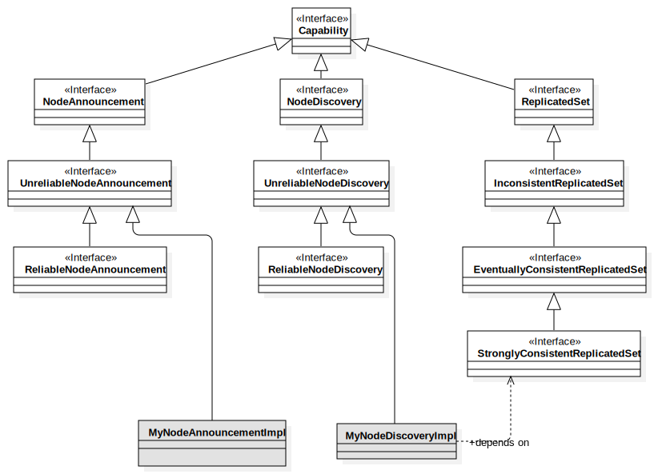

# Capabilities 

[TOC]

Node capabilities are the core of any useful Monastery functionality. Under the assumption that we really cannot know what sort of distributed functionality are needed and what sorts of functionality will be invented in the future, Monastery makes no assumptions on what capabilities exist. Monastery allows to build up a custom made solution by composing multiple capabilities into a node, and then using those capabilities to make nodes perform useful work together.

The elementary lifecycle of a capability allows a capability to interact with its surrounding environment.

* After the capability is added to a node it is bound to the node, so that it can maintain a reference to the node (if it wishes to). At this stage the final set of capabilities of the node is not yet known. If the capability needs other capabilities to function, it should wait until all capabilities have been added before attempting to resolve all of its dependencies.
* When all capabilities have been added to the node, but before the build is complete, the node or the builder will call onAllCapabilitiesBound() so that the capability may resolve its dependencies on other capabilities or on some aspect of the node implementation. At this stage the capability may know whether it can function or not, and may signal dissatisfaction via an exception.

## Capability conventions

In Monastery, capabilities are supposed to have a very narrow scope. Each capability should do one thing (and do it well). This focuses up the development of capabilities. It facilitates making capabilities understandable. And it allows one to compose a "tailor fit" solution out small and focused capabilities.

For instance:

* `NodeAnnouncement` is only concerned with letting the cluster know that the node exists. That's it.
* `NodeDiscovery` focuses on the cluster telling a node that other nodes exist.
* A `ReplicatedLogWithStrongConsistency` capability would only focus on doing the one thing it is intended for. An underlying implementation may give you a replicated log with all kinds of consistency guarantees and a gazillion options. That is OK. When those are exposed to Monastery, they should be broken up into small, individual capabilities that ideally conform to some of the built-in capability APIs.

Part of the minimalism of Monastery is that not every conceivable option needs to be exposed via an interface. The opposite is the convention here: expose what is minimally needed to get the basic functionality working. If you want to expose more functionality or options, you have two ways to do it:

1. Let the user use your own implementation class directly (at the risk of incompatibility)
2. Expose the other functionality and/or options as separate, narrow capabilities. Perhaps some of those are defined broadly enough that they would be appropriate to publish as "core" capabilities.

Capability interfaces should be strictly focused on the "what" not the "how". The example of a `ReplicatedLogWithStrongConsistency` should provide an interface and a contract that promises a well understood external behavior. Whether the implementation leverages a replicated state machine with Paxos, or is implemented on top of ZooKeeper is "just and implementation detail".

Cluster implementations can vary considerably in what they can actually do. Some technologies, for instance offer a consensus protocol like Paxos or Raft, and can support strongly consistent replicated data. Others may allow data replication but in an eventually consistent fashion, or maybe even with no consistency guarantees. Similarly, a solution may offer simple messaging: broadcast, or publish/subscribe facilities, but they may vary in their reliability.

To allow a solution to clearly express what they offer, built-in capability interfaces are organized in clear hierarchies expressing the conceptual contracts of the solution. See an example in the following diagram:

In this diagram an implementation implements `UnreliableNodeAnnouncement`, and a discovery capability implements `UnreliableNodeDiscovery` and depends on a `StronglyConsistentReplicatedSet`. 

In this situation, if one tries to look up a `NodeAnnouncement` capability from the `Node` implementation, then the provided capability would be found. However, if one tries to look up a `ReliableNodeAnnouncement` capability, then no such capability is found. By using a hierarchy, one can express dependencies based on the minimal capability needed.

This becomes very useful when one attempts to construct complex compound capabilities that are attempt to be independent from the specific cluster implementation. For instance, a compound capability may need a `EventuallyConsistentReplicatedProperties` capability and a `UnreliableNodeDiscovery` capability in order to be able to minimally function. Any capability that is available, even if it exceeds the requirement, would work for this compound capability.

## Core capabilities

### `NodeAnnouncement`

Node announcement allows a node to announce itself to the cluster. Normally, the outcome of a successful announcement is that the node joins the cluster. This is to say, the underlying cluster implementation is aware of the existence of the node, and the node ID is a valid and unique ID in the cluster. Note that implementations may have a statically configured node ID, but after successful announcement we know that this ID is indeed a unique ID in the cluster regardless of whether it was assigned before joining or as a side effect of joining.

### `NodeDiscovery`

Node discovery is the mirror image of node announcement. A node that has this capability can be notified by the cluster when new nodes join the cluster. It can also obtain a list of known nodes in the cluster, including nodes that existed before this capability was activated.

Note that the reliability of both of these functions is dependent on the specific implementation. The minimal contract is that any node information provided by either function is true. That is to say, there are no "false positives" any information provided reflects a real node that exists, or existed at some point in the life of the cluster.

In all implementation the information does not mean that the node is healthy, functional, reachable, or in any way functional. It only means that it managed to announce itself to the cluster at some point of time.

## Low level capabilities

----

**todo: describe the set of low level capabilities that implementations should provide as a basis for composite capabilities**