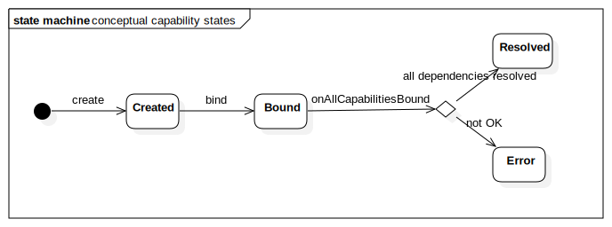

# Capability 

Node capabilities are the core of any useful Monastery functionality. Under the assumption that we really cannot know what sort of distributed functionality are needed and what sorts of functionality will be invented in the future, Monastery makes no assumptions on what capabilities exist. Monastery allows to build up a custom made solution by composing multiple capabilities into a node, and then using those capabilities to make nodes perform useful work together.

The elementary lifecycle of a capability allows a capability to interact with its surrounding environment.

* After the capability is added to a node it is bound to the node, so that it can maintain a reference to the node (if it wishes to). At this stage the final set of capabilities of the node is not yet known. If the capability needs other capabilities to function, it should wait until all capabilities have been added before attempting to resolve all of its dependencies.
* When all capabilities have been added to the node, but before the build is complete, the node or the builder will call onAllCapabilitiesBound() so that the capability may resolve its dependencies on other capabilities or on some aspect of the node implementation. At this stage the capability may know whether it can function or not, and may signal dissatisfaction via an exception.

## Capability convensions

In Monastery, capabilities are supposed to have a very narrow scope. Each capability should do one thing (and do it well). This focuses up the development of capabilities. It facilitates making capabilities understandable. And it allows one to compose a "tailor fit" solution out small and focused capabilities.

For instance:

* `NodeAnnouncement` is only concerned about letting the cluster know that the node exists. That's it.
* `NodeDiscovery` focuses on the cluster telling a node that other nodes exist.
* A `ReplicatedLogWithStrongConsistency` capability would only focus on doing the one thing it is intended for. An underlying imploementation may give you a replicated log with all kinds of consistency guarantees and a gazillion options. That is OK. When those are exposed to Monastery, shey shoud be broken up into small, individual capabilities that ideally conform to some of the built-in capabiulity APIs.

Part of the minimalizm of Monastery is that not every coceivable option needs to be exposed via an interface. The opposite is the convension here: expose what is minimally needed to get the basic functionality working. If you want to expose more functionality or options, you have two ways to do it:

1. Let the user use your own implementation calss directly (at the risk of incompatibility)
2. Expose the other functionality and/or options as separate, narrow capabilities. Perhaps some of those are defined boardly enough that they would be apopropriate to publish as "standard" capabilities.

Capability interfaces should be strictly focused on the "what" not the "how". The example of a `ReplicatedLogWithStrongConsistency` should provide an interface and a contract that promises a well understood external behavior. Whether the implementation leverages a replicated state machine with Paxos, or is implemented on top of ZooKeeper is "just and implementatin detail".