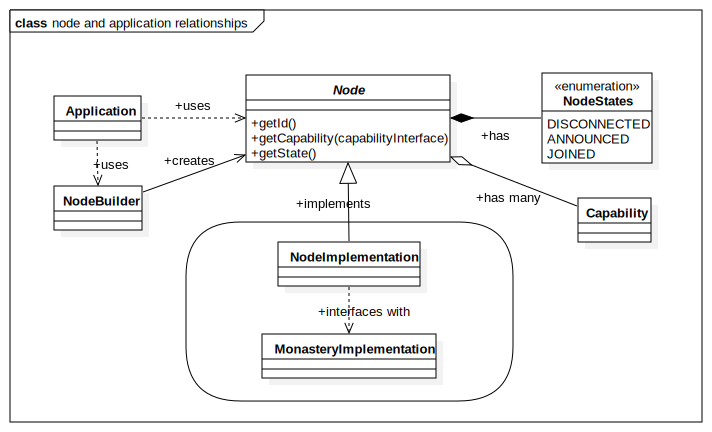

# The Node

The `Node` interface is the main interface between the application and the cluster. It is a representation of the local node's runtime cluster identity, and the interface via which the application obtains access to the cluster's capabilities.

The application obtains a reference to a `Node` from the implementing library or framework, and after that it uses it to communicate with the cluster by getting references to appropriate capabilities and using those.

The `Node` itself is very minimal. All it has is:

1. An ID
2. A method to get `Capability` object references of any implemented `Capability` interface.
3. An elementary state of the node in the cluster (non-functional)

## Node ID

The node ID represents the runtime identity of the local node in the cluster.

* The ID must be unique cluster-wide. This is enforced by the implementation.
* The ID may be `null` until the node is in a `JOINED` state
* The ID is provided by the implementation and the application may not have control over it (read-only)
* The ID may not change for at least as long as the node is joined to the cluster

Note that the ID may or may not be persistent, and it may or may not exist before the node is joined to the cluster.

## Node life cycle

The local node's states are very simple, and are not intended for complex state management. That is left for appropriate capabilities. The node has a very linear lifecycle:

1. When the node starts out, it is in a `DISCONNECTED` state. At this stage, no node in the cluster knows about the local node, and it does not communicate with the cluster.
2. To join the cluster the `Node` is 'announced' to the cluster. Once announced, the node switches to an `ANNOUNCED` state. In this state, the node is still not usable as a cluster node, but the implementation is "working on it"
3. When the process of joining the cluster is complete, the node enters its final stage, which is `JOINED`. At this state, we know that the node's existence is now been known to the cluster and it's runtime ID has been established.

Note that importantly, being in a `JOINED` state says nothing about whether the node is usable, whether it can connect with the cluster, or whether it is in any way healthy or functional. What you *do know* is that *until* it is in a `JOINED` state, there is no point in trying to obtain or use any capabilities.

So joining the cluster, is basically a "green light" to start using its capabilities.

## Capabilities

## Working with the `Node`
