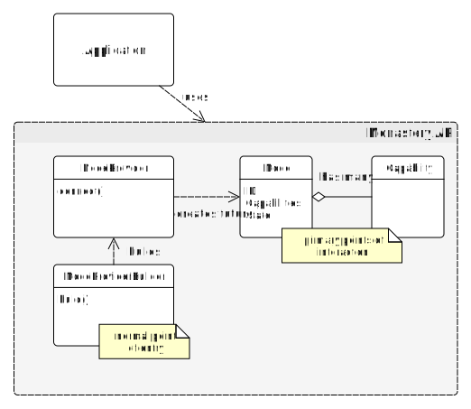

# The Node <span style="float:right"><span>

The `Node` interface is the main interface between the application and the cluster. It is a representation of the local node's runtime cluster identity, and the interface via which the application obtains access to the cluster's capabilities.

The application obtains a reference to a `Node` from the implementing library or framework, and after that it uses it to communicate with the cluster by getting references to appropriate capabilities and using those.



The `Node` itself is very minimal. All it has is:

1. An ID
2. A method to get [`Capability`](Capabilities.md) object references of any implemented `Capability` interface.
3. An elementary state of the node in the cluster (non-functional)

## Node ID

The node ID represents the runtime identity of the local node in the cluster.

* The ID must be unique cluster-wide. This is enforced by the implementation.
* The ID may be `null` until the node is in a `JOINED` state
* The ID is provided by the implementation and the application may not have control over it (read-only)
* The ID may not change for at least as long as the node is joined to the cluster

Note that the ID may or may not be persistent, and it may or may not exist before the node is joined to the cluster.

## Node life cycle

The local node's states are very simple, and are not intended for complex state management. That is left for appropriate capabilities. The node has a very linear lifecycle:


1. When the node starts out, it is in a `DISCONNECTED` state. At this stage, no node in the cluster knows about the local node, and it does not communicate with the cluster.
2. To join the cluster the `Node` is 'announced' to the cluster. Once announced, the node switches to an `ANNOUNCED` state. In this state, the node is still not usable as a cluster node, but the implementation is "working on it"
3. When the process of joining the cluster is complete, the node enters its final stage, which is `JOINED`. At this state, we know that the node's existence is now been known to the cluster and it's runtime ID has been established.

Note that importantly, being in a `JOINED` state says nothing about whether the node is usable, whether it can connect with the cluster, or whether it is in any way healthy or functional. What you *do know* is that *until* it is in a `JOINED` state, there is no point in trying to obtain or use any capabilities.

So joining the cluster, is basically a "green light" to start using its capabilities.

> **Note**
> 
> The node lifecycle described here is actually not built-in to the node. 
> It is a `Capability`, and like all capabilities it is both pluggable ad optional.
> Having said this, many capabilities rely on the node ID, and may need to know that the node is actually joined to the cluster and that the ID is valid in the cluster. So in practice, this is quite central. 
> 
> It is possible, however for an implementation to forgo implementing the node announcement capability and ignore this state model, or introduce a different one.

## Building a node
In the simplest case, one implementation provides all the node capabilities in one neat package. In cases like this, an implementation may simply provide a constructor, and you could be done there: `Node<Integer> node = new NodeImpl();`

But the idea is that there may be many sources of capabilities, some quite independent from the others. So an implementation of Monastery should also implement the `NodeBuilder` interface and allow you to put together a local node from several capability sources, like so:

```Java
NodeBuilder builder = new NodeBuilderImpl(); // NodeBuilderImpl implements NodeBuilder
Node<String> node = builder
    .add(new Capability1())
    .add(new Capability2())
    .build();
```

The provided `NodeBuilder` may start you out with a bunch of capabilities provided by the implementation, or may leave it to you to pick and choose. You can add more capabilities, which may come from any source, and thus enrich the node with any functionality you need from it.

## Capabilities
Capabilities are discussed in more detail in the [capabilities page](Capabilities.md).

In short, the node itself provides no real functionality. It is just a container for pluggable capabilities, which are all entirely optional. Monastery is unopinionated about what capabilities a cluster should have, nor has it any opinion on what algorithms should be used or what their attributes should be.

So what is the point?

Monastery does provide a set of predefined capabilities, defined as interfaces, and their documented contracts. Those provide a template of sorts for Monastery implementations to provide a common view of the cluster with interchangeable implementations. This is similar to some of the javax APIs, which provide standard interfaces but no implementations, leaving it to the community to provide implementations.

While Monastery provides a set of standard capability interfaces, anyone can add additional capability interfaces without changing or breaking the Monastery API (implementation behavior can be broken, naturally).

In a separate project, a Monastery base implementation of some of the capabilities is provided to ease the development of implementations, but that is also not mandatory to use.

## Working with the `Node`

Since the node is so minimal, there is nothing much you can do with it. All the real functionality comes in the capabilities it is made up of. Monastery defines several built-in capability interfaces and provides some abstract patial implementations. An implementation would implement some subset of concrete capabilities, and may add more that are not represented by built-in interfaces.

For example, given a node that has a `NodeAnnouncement` capability, you can invoke the functionality of the capability like so:

```Java
try {
   NodeAnnouncement<?> nodeAnnouncement = node.getCapability(NodeAnnouncement.class).get();
   nodeAnnouncement.addJoinListener(node -> System.out.println("Node joined (known via callback)"));
   nodeAnnouncement.announce().thenAcceptAsync(nodeAnnouncer -> {
       System.out.printf("\nfinished with ID %s and state %s\n", node.getId(), nodeAnnouncer.getState()); // state is JOINED
   });
}
catch(Throwable ex) {
   throw new Exception("No node announcement capability available");
}
```

The node implementation ensures that the capability lidecycle is properly managed. See more on the in the [capabilities page](Capabilities.md)

Note the convensions in Monastery:
* All interface methods that may require remote communications return `CompletableFuture` objects. This makes working with nodes either synchronously or asynchronousely a snap. Both examples are shown above.
* `null` is never returned, or passed to callbacks.
  * If a value can be legitimately missing then Monastery interfaces use `Optional` to make that explicit.
  * If a value is not wrapped in an `Optional` then it is expected to be not `null` and if it's not there then it's an error and an exception will occur.

In the code example above, it is assumed that if you are calling `getCapability()` you are expressing a dependency on this capability, and that a null is not acceptable. Therefore if a matching capability is not found in the node, then the future will complete exceptionally.

Similarly, when you pass join listener to `addJoinListener()`, the parameter is not `Optional`, therefore passing a `null` will get you in trouble: either an exception will be thrown immediately, or later, when the `NodeAnnouncement` capability tries to invoke your action.
